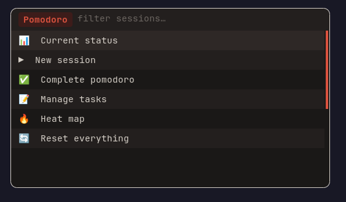
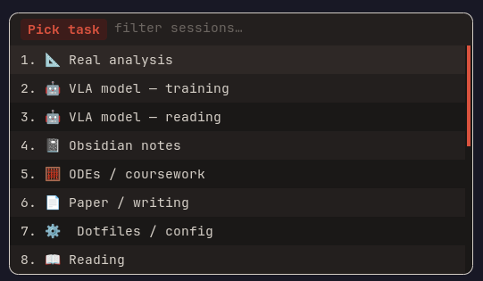
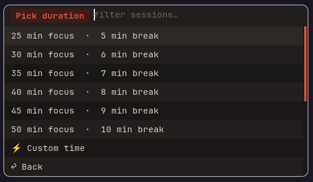
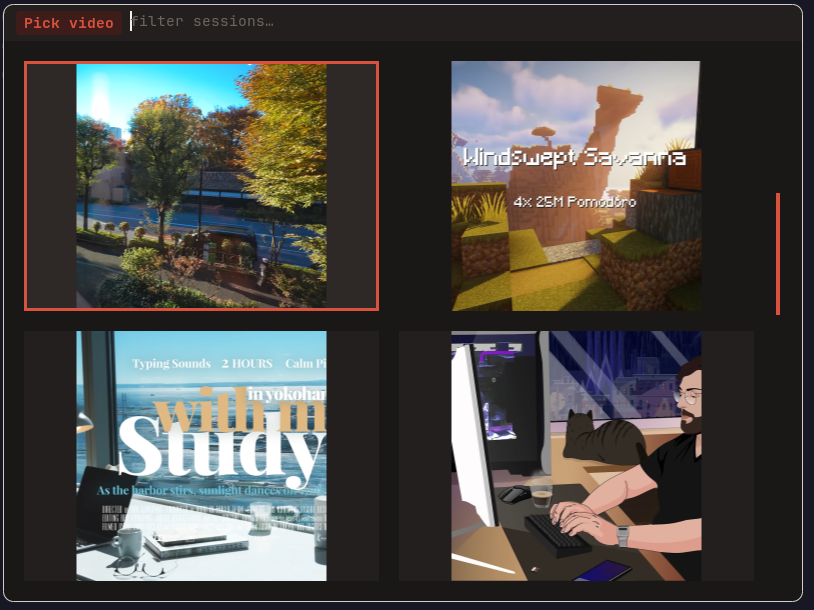

# 🍅 Pomodoro Rofi

A **Pomodoro timer** with a [Rofi](https://github.com/davatorium/rofi) UI,
[Polybar](https://github.com/polybar/polybar) integration,
fullscreen ambient/study videos via [mpv](https://mpv.io/),
and a GitHub-style contribution heatmap.

---

## Features

| Feature | Description |
|---|---|
| **Rofi UI** | Intuitive dmenu-based interface for starting sessions, managing tasks, viewing heatmaps, and more. |
| **Ambient videos** | Plays a looping, fullscreen mpv video during work sessions (supports `.mp4` and `.webm` with thumbnail previews). |
| **Configurable rhythms** | Set custom work/break durations, pomodoro counts, and warm-up periods. Presets per video available. |
| **Task management** | Maintain two lists: **everyday** tasks (persistent) and **unique** tasks (one-off). Edit, rename, or delete tasks from the UI. |
| **History & logging** | Every completed session is logged with a timestamp, task name, duration, and session count. |
| **Heatmap** | Two heatmap views — a quick Rofi-based one and a full interactive [Textual](https://textual.textualize.io/) TUI with clickable day cells. |
| **Polybar integration** | Display the current timer status in your Polybar and control it with CLI subcommands (`status`, `toggle`, `stop`, `next`). |
| **Pause / Resume** | Pause the current session and resume later. The video pauses along with the timer. |
| **Notifications** | Uses `dunstify` for desktop notifications at session start, break start/end, and session completion. |

---

## Screenshots

| Main menu | Task picker | Duration picker |
|---|---|---|
|  |  |  |

 | Active session |
|---|
|  |

(Screenshots are illustrative — replace with your own.)

---

## Installation

### Dependencies

- **Python** 3.10+
- [Rofi](https://github.com/davatorium/rofi) — the UI framework
- [mpv](https://mpv.io/) — video playback
- [socat](http://www.dest-unreach.org/socat/) — mpv IPC
- [dunstify](https://github.com/dunst-project/dunst) (part of `dunst`) — notifications
- [i3](https://i3wm.org/) or compatible window manager (for workspace switching) — optional
- [Polybar](https://github.com/polybar/polybar) — optional, for status line integration
- [Textual](https://textual.textualize.io/) `pip install textual` — optional, for the interactive heatmap

### Install

```bash
git clone https://github.com/jorgemunozl/pomodoro_rofi.git
cd pomodoro_rofi

# Make the CLI accessible
ln -s ~/project/pomodoro_rofi/pomodoro ~/.local/bin/pomodoro

# Copy the Rofi theme
cp pomodoro.rasi ~/.config/rofi/pomodoro.rasi

# Have videos on ~/Videos/study
```

### Rofi theme

A custom Rofi theme is expected at `~/.config/rofi/pomodoro.rasi`.
You can create your own or adapt an existing one. Example minimal theme:

```
* {
    background:     #1e1e2e;
    background-alt: #181825;
    foreground:     #cdd6f4;
    urgent:         #f38ba8;
}
window {
    width: 520px;
}
listview {
    lines: 12;
}
```

---

## Usage

### Launch the UI

```bash
pomodoro
```

This opens the Rofi main menu with the following options:

- **New session** — select a task, video, duration, and pomodoro count to start.
- **Complete pomodoro** — log a completed session manually.
- **Manage tasks** — view, add, edit, or delete everyday and unique tasks.
- **Heat map** — launch the Rofi-based heatmap.
- **Reset everything** — clear all active state.

### Polybar subcommands

```bash
pomodoro status    # Print current status line (polled by Polybar)
pomodoro toggle    # Pause / resume the current session
pomodoro stop      # Stop the current session and clean up
pomodoro next      # Skip to the next phase (work → break or break → work)
```

### Example Polybar module

```ini
[module/pomodoro]
type = custom/script
interval = 2
exec = pomodoro status
click-left = pomodoro toggle
click-right = pomodoro stop
click-middle = urxvt -e pomodoro
```

---

## Project Structure

```
pomodoro_rofi/
├── pomodoro              # CLI entry point (executable)
├── pomodoro_lib/
│   ├── __init__.py       # Package marker
│   ├── config.py         # Paths, presets, and defaults
│   ├── state.py          # PomodoroState dataclass + JSON persistence
│   ├── timer.py          # TimerController — background thread, mpv, notifications
│   ├── rofi.py           # Rofi menu helpers (dmenu wrappers)
│   ├── main.py           # CLI dispatch, main menu loop, UI flow
│   ├── tasks.py          # TaskManager — everyday & unique task lists, history
│   ├── heatmap.py        # History parsing, statistics, Rofi heatmap display
│   └── heatmap_app.py    # Textual TUI interactive heatmap
└── README.md
```

---

## Configuration

### Paths

All paths are defined in [`pomodoro_lib/config.py`](pomodoro_lib/config.py) and can be
overridden by setting the `XDG_CONFIG_HOME` environment variable.

| Path | Default | Purpose |
|---|---|---|
| Videos directory | `~/Videos/study` | Place `.mp4` / `.webm` files here. Thumbnails (same name, `.jpg`) shown in the video picker. |
| Tasks (everyday) | `~/.config/pomodoro/tasks` | Persistent everyday tasks |
| Tasks (unique) | `~/.config/pomodoro/tasks_unique` | One-off tasks |
| History | `~/.config/pomodoro/history` | Session logs |
| State | `/tmp/pomo_state.json` | Active session state |
| Rofi theme | `~/.config/rofi/pomodoro.rasi` | Rofi styling |

### Video presets

In `config.py`, the `POMODORO_DEFAULTS` list lets you define default rhythms per video:

```python
POMODORO_DEFAULTS = [
    ("video_name.webm", 25, 5, 4, 77.5),
    #                   ^   ^  ^  ^
    #                   |   |  |  └── warm-up seconds
    #                   |   |  └────── pomodoro count
    #                   |   └───────── break minutes
    #                   └───────────── work minutes
]
```

When a video with a default rhythm is selected, the UI asks if you want to use
it or pick a personalized rhythm.

### Duration presets

Six presets are available (25/5, 30/6, 35/7, 40/8, 45/9, 50/10), plus a custom
option where you type `work-break` (e.g. `10-5`).

---

## How it works

1. **Starting a session** — The UI walks you through task → video → duration → count.
   A daemon timer thread is spawned that manages work/break cycles. mpv plays the
   selected video fullscreen on a dedicated i3 workspace (`🍅`).

2. **Phase transitions** — When a work or break period expires, the timer thread
   updates state, sends a notification, and starts the next phase. The Polybar
   status line also checks for expired phases on every poll (a reliable fallback
   if the original UI process exited).

3. **Pause / Resume** — Remaining seconds are written to `/tmp/pomo_pause`.
   mpv is paused via its IPC socket. Resuming reads the file and restarts
   the timer.

4. **Heatmap** — The history file is parsed and aggregated into a GitHub-style
   contribution grid. The Rofi version shows a static grid; the Textual TUI
   version supports clicking individual day cells for a detailed breakdown.

---

## License

[MIT](LICENSE)
